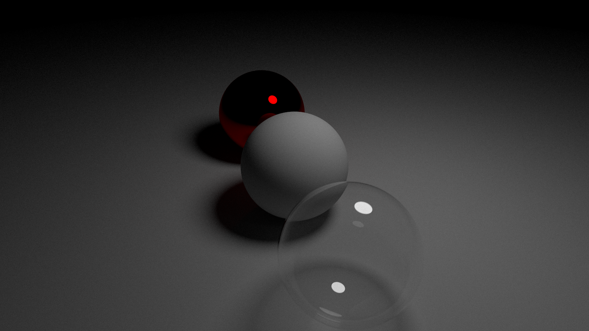
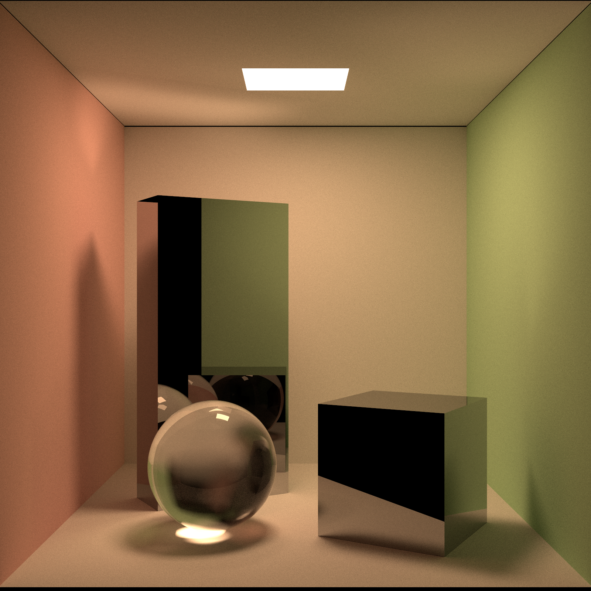
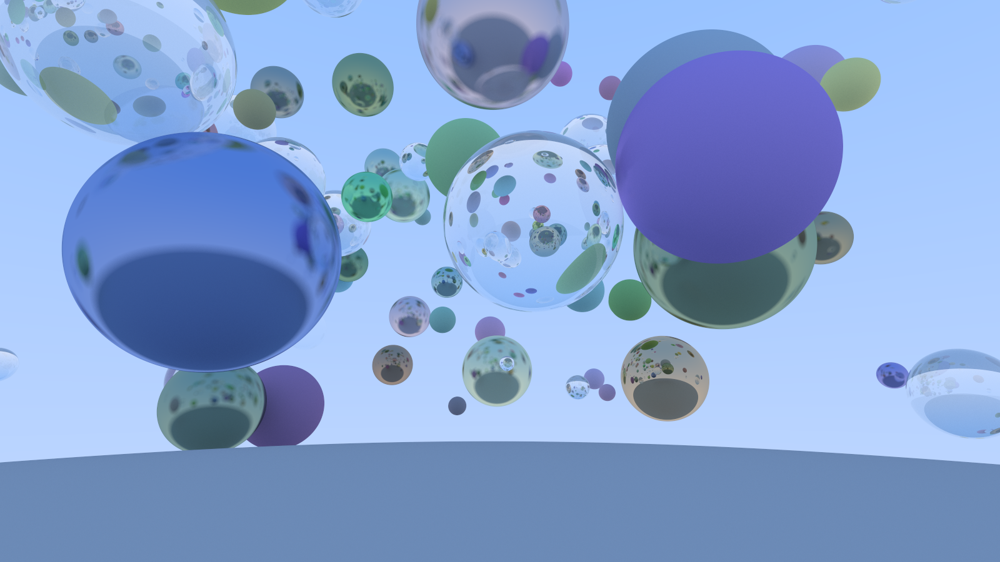

# Tiny ray-tracing engine








https://user-images.githubusercontent.com/391964/190847141-f8d34b08-77af-44bb-be1e-976d0b39aafc.mp4

# How to run

```shell
cargo run --release -- spheres
cargo run --release -- many-spheres
cargo run --release -- many-boxes
cargo run --release -- lighted-spheres
cargo run --release -- cornell-box
# with full options
cargo run --release -- \
  --width 1600 \
  --height 1600 \
  --num-rays 8192 \
  --num-reflections 256 \
  --output "cornell-box.png" \
  cornell-box
# Make an animation (anim/1.png, anim/2.png, ...)
cargo run --release -- \
  --animation \
  --width 1024 \
  --height 1024 \
  --num-rays 8192 \
  --num-reflections 256 \
  --output "anim" \
  cornell-box
```

# References

## Ray Tracing (Path Tracing)

- [週末レイトレーシング (翻訳)](https://inzkyk.xyz/ray_tracing_in_one_weekend/)
- [週末レイトレーシング - 達人出版会](https://tatsu-zine.com/books/ray-tracing-part1)
- [Physically Based Rendering: From Theory to Implementation](https://www.pbr-book.org/)
- [awesome-ray-tracing: Curated list of ray tracing resources](https://github.com/dannyfritz/awesome-ray-tracing)
- [Computer Graphics - memoRANDOM](https://rayspace.xyz/CG/)
- [Courses - p-ray](https://p-ray.oskt.us/courses/)

## Quaternion

- [ハミルトンとベクトルの誕生１ー四元数の発見 - YouTube](https://www.youtube.com/watch?v=af2PQ4WR3N4)
- [クォータニオン (Quaternion) を総整理！ ～ 三次元物体の回転と姿勢を鮮やかに扱う ～ - Qiita](https://qiita.com/drken/items/0639cf34cce14e8d58a5#1-2-%E3%82%AF%E3%82%A9%E3%83%BC%E3%82%BF%E3%83%8B%E3%82%AA%E3%83%B3%E3%81%AB%E3%82%88%E3%82%8B%E5%9B%9E%E8%BB%A2%E6%93%8D%E4%BD%9C)
[Quaternionによる3次元の回転変換 - Qiita](https://qiita.com/kenjihiranabe/items/945232fbde58fab45681)
- [【Unity道場 大阪スペシャル in モリサワ 2017】クォータニオン完全マスター - YouTube](https://www.youtube.com/watch?v=g7vsR0l7eBM)
- [納涼クォータニオン夏祭り - Unityステーション - YouTube](https://www.youtube.com/watch?v=HCTQNJu8OhE)
