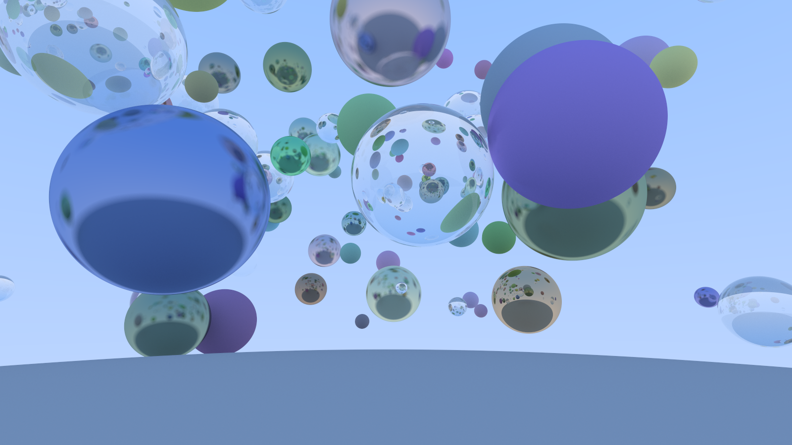

# Tiny ray-tracing engine




# How to run

```shell
cargo run --release SCENE
```

Available scenes:
  - `spheres`
  - `many-spheres`
  - `lighted-spheres`

# References

- [週末レイトレーシング (翻訳)](https://inzkyk.xyz/ray_tracing_in_one_weekend/)
- [週末レイトレーシング - 達人出版会](https://tatsu-zine.com/books/ray-tracing-part1)
- [dannyfritz/awesome-ray-tracing: Curated list of ray tracing resources](https://github.com/dannyfritz/awesome-ray-tracing)
